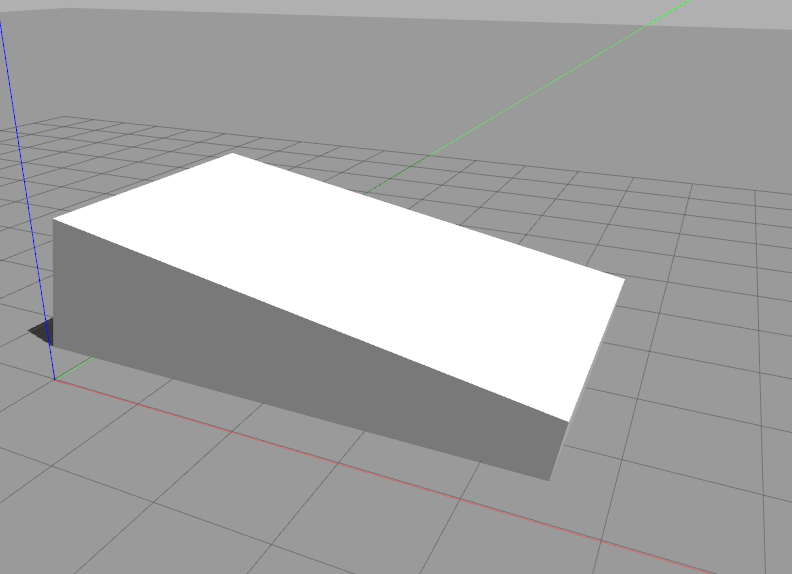
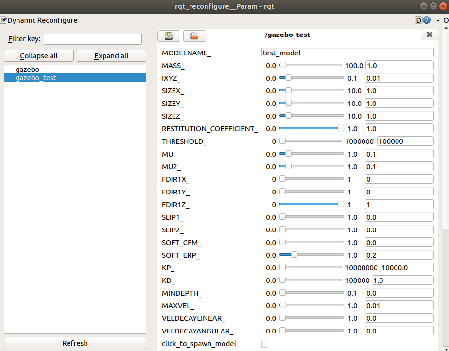

# Learning about Gazebo physics

This package lets you test different physics parameters in Gazebo to give you a better understanding of how they change the simulation e.g. friction parameters.



## How to run
Launch Gazebo with and empty world

```sh
$ roslaunch gazebo_tests empty_gazebo.launch
```

Enable spawning of box and ramp

```sh
$ rosrun gazebo_tests spawn_by_params.py
```

Open RQT Dynamic Reconfigure to spawn new boxes with different physics parameters. Set the parameters you would like to test and press the checkbox `click_to_spawn_model` to spawn a box.

```sh
$ rosrun rqt_reconfigure rqt_reconfigure
```



**_Optional:_**

Automatic loop through one parameter multiplying by 10
```sh
$ rosrun gazebo_tests loop_parameter_example.py
```


## Gazebo world properties
http://gazebosim.org/tutorials?tut=modifying_world

In the `World` tab, select the `Physics` item. A list of physics properties will be displayed in the list box below.

* The `enable physics` check-box can be used to disable physics while allowing plugins and sensors to continue running.
* The `real time update rate` parameter specifies in Hz the number of physics updates that will be attempted per second. If this number is set to zero, it will run as fast as it can. Note that the product of real time update rate and max step size represents the target real time factor, or ratio of simulation time to real-time.
* The `max step size` specifies the time duration in seconds of each physics update step.

In the gravity block:

* The `x`, `y` and `z` parameters set the global gravity vector components in `m/s^2`.

In the solver block:

* The `iterations` parameter specifies the number of iterations to use for iterative LCP solvers (used by ODE and bullet).
* The `SOR` parameter stands for `successive over-relaxation`, which can be used to try to speed the convergence of the iterative method.

The `constraints` block contains several parameters related to solving constraints:

* The `CFM` and `ERP` parameters stands for `Constraint Force Mixing` and `Error Reduction Parameter` and are used by `ODE` and `bullet`. The CFM and ERP parameters can be related to linear stiffness and damping coefficients.
* The `max velocity` and `surface layer` parameters are used to resolve contacts with a split impulse method. Any contacts that penetrate deeper than a depth specified by `surface layer` and have a normal velocity less than `max velocity` will not bounce.

## Objects

### Friction

http://gazebosim.org/tutorials?tut=friction

When two object collide, such as a ball rolling on a plane, a friction term is generated. In ODE this is composed of two parts, `mu` and `mu2`, where:

* `mu` is the Coulomb friction coefficient for the first friction direction, and

* `mu2` is the friction coefficient for the second friction direction (perpendicular to the first friction direction).

ODE will automatically compute the first and second friction directions for us. Note, you can manually specify the first friction direction in SDF, but this capability is out of the scope of this tutorial.

The two objects in collision each specify `mu` and `mu2`. Gazebo will choose the smallest `mu` and `mu2` from the two colliding objects.

The valid range of values for `mu` and `mu2` is any non-negative number, where 0 equates to a friction-less contact and a large value approximates a surface with infinite friction. Tables of friction coefficient values for a variety of materials can be found in engineering handbooks or online references.

ODE spec: http://sdformat.org/spec?elem=collision&ver=1.4

* `mu`: Coefficient of friction in the range of `[0..1]`. (default 1)
* `mu2`: Second coefficient of friction in the range of `[0..1]`. (default 1)
* `fdir1`: 3-tuple specifying direction of mu1 in the collision local reference frame. (default 0 0 0)
* `slip1`: Force dependent slip direction 1 in collision local frame, between the range of `[0..1]`. (default 0)
* `slip2`: Force dependent slip direction 2 in collision local frame, between the range of `[0..1]`. (default 0 )


### Contact

* `soft_cfm`: Soft constraint force mixing. (default 0)
* `soft_erp`: Soft error reduction parameter. (default 0.2)
* `kp`: Dynamically "stiffness"-equivalent coefficient for contact joints. (default 1e+12)
* `kd`: Dynamically "damping"-equivalent coefficient for contact joints. (default 1)
* `max_vel`: Maximum contact correction velocity truncation term. (default 0.01)
* `min_depth`: Minimum allowable depth before contact correction impulse is applied. (default 0)


### Bounce

* `restitution_coefficient`: Bounciness coefficient of restitution, from [0..1] where 0=no bounciness. (default 1)
* `threshold`: Bounce capture velocity, below which effective coefficient of restitution is 0. (default 100000)

# Notes learnt

* A inertia matrix diagonal terms that goes lower than mass / 1000.0 makes the item unstable (w/ ground at least). Using standard inertia matrix for cubes, cylinders or spheres works good enough. I made a [little program to compute them](https://gist.github.com/awesomebytes/39a4ba6c64956a1aa9bd).
* KP minimum 10000. The tinier... it does not converge on getting onto a static position. Also, it must affect joint elements in gazebo, simple objects may be less affected by it (to be proven).
* `SOFT_CFM` and `SOFT_ERP` don't do anything. Gazebo Physics CFM and ERP can be tuned online from the Gazebo GUI client. They seem to slow down or not let two items in contact converge in a static position.
* `mu` and `mu2` are (as the documentation states) in between [0.0..1.0], anything over 1.0 will be truncated to 1.0, infinite friction (like ground_plane).
* `fdir1` 3 element vector, are x y z, in local frame. There is some info in [this gazebo answers](http://answers.gazebosim.org/question/1512/what-do-the-friction-coefficients-mean-and-why-are-they-so-large-in-the-drcsim-atlas-urdf-files/).
